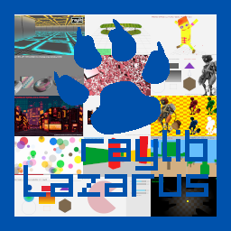

## Huge collection with +120 code examples for [ray4laz](https://github.com/GuvaCode/ray4laz) package.

### [Audio:](https://github.com/GuvaCode/Ray4Laz-Example/blob/main/examples/audio/)
- audio mixedprocessor
- audio module playinig
- audio multichannel sound
- audio music stream
- audio raw stream
- audio sound loading

### [Core:](https://github.com/GuvaCode/Ray4Laz-Example/blob/main/examples/)
- world screen
- basic screen manager
- window letterbox
- custom logging
- 2d camera
- 2d camera mouse zoom
- 3d camera first person
- window flags
- split screen
- automation events
- random sequence
- input gamepad
- 3d camera free
- 3d picking
- storage values
- loading thread
- input keys
- input multitouch
- drop files
- 3d camera mode
- random values
- scissor test
- basic window
- 2d camera split screen
- window should close
- smooth pixelperfect
- input mouse
- vr simulator
- input mouse wheel
- 3d camera split screen
- 2d camera platformer
- custom frame control

### [Extra:](https://github.com/GuvaCode/Ray4Laz-Example/blob/main/extra/)
- r3d/fog
- r3d/basic
- r3d/lights
- r3d/skybox
- r3d/particles
- r3d/sprite
- r3d/transparency
- r3d/bloom
- r3d/resize
- r3d/pbr
- r3d/sponza
- r3d/instanced
- r3d/directional
- raylib-gizmo/getting started
- raylib-gizmo/gizmo types
- raylib-media/basics

### [GUI:](https://github.com/GuvaCode/Ray4Laz-Example/blob/main/gui/)
- controls test suite
- motion

### [Models:](https://github.com/GuvaCode/Ray4Laz-Example/blob/main/models/)
- cubicmap
- billboard
- draw cube texture
- skybox
- tesseract view
- geometric shapes
- waving cubes
- orthographic projection
- yaw pitch roll
- loading
- mesh picking
- loading vox
- point rendering
- gpu skinning
- rlgl solar system
- first person maze
- bone socket
- box collisions
- loading gltf
- animation
- loading m3d
- heightmap
- mesh generation

### [Other:](https://github.com/GuvaCode/Ray4Laz-Example/blob/main/other/)
- embedded files loading
- raymath vector angle

### [Shaders:](https://github.com/GuvaCode/Ray4Laz-Example/blob/main/shaders/)
- shaders write depth
- shaders shadowmap
- shaders lightmap
- shaders texture waves
- shaders shapes textures
- shaders custom uniform
- shaders mesh instancing
- shaders simple mask
- shaders julia set
- shaders vertex displacement
- shaders multi sample2d
- shaders texture drawing
- shaders postprocessing
- shaders fog
- shaders hybrid render
- shaders eratosthenes
- shaders texture outline
- shaders deferred render
- shaders raymarching
- shaders basic lighting
- shaders texture tiling
- shaders palette switch
- shaders spotlight
- shaders hot reloading
- shaders model shader
- shaders basic pbr

